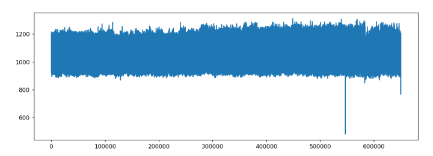
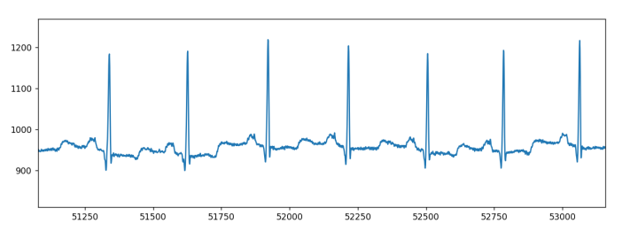
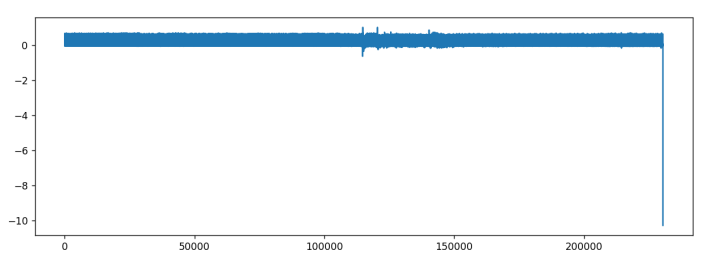
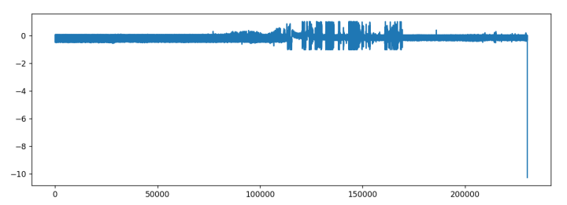
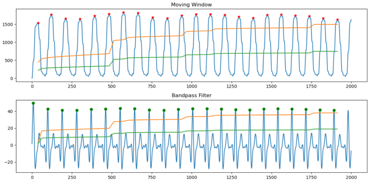
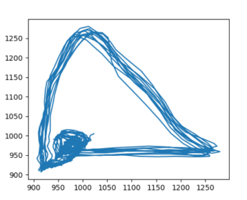

# 1 ecg-algorithm
使用python编写心电相关的算法，包括滤波，R波识别，心率计算，特征提取，心率失常分类，房颤，伪差干扰研究等相关算法，以及较好的可视化功能，和一些测试工程

# 2 已经实现的程序
## 2.1 数据读取
### 2.1.1 Format212 数据格式读取
- 以MIT-BIH心电数据库中100.dat为例  
  

### 2.1.2 Format16 数据格式读取
- PAF数据库n01为例  
  

## 2.2 Pan-Tompkins算法
### 2.2.1 简介
Pan-Tompkins算法最早在1985年发表，它是一种高效实用的QRS波检测算法，至今仍然被许多心电监护仪、
Holter和一些穿戴式设备所实用或者借鉴算法思路进行优化。
### 2.2.2 代码使用
- 路径：ecg/basic_alg/pan_tompin.py
- 直接运行代码即可
- 输出图片  

## 2.3 相位重构算法
### 2.3.1 简介
通过非线性动力学进行的相位重构算法，应用在ECG的R波识别上，具有较高的准确率，并对干扰环境中
也保持良好的性能。
### 2.3.2 代码使用
- 路径：ecg/base_alg/delay_coordinate_mapping.py
- 直接运行代码即可
- 图片，一些图片需要打开注释才可以

